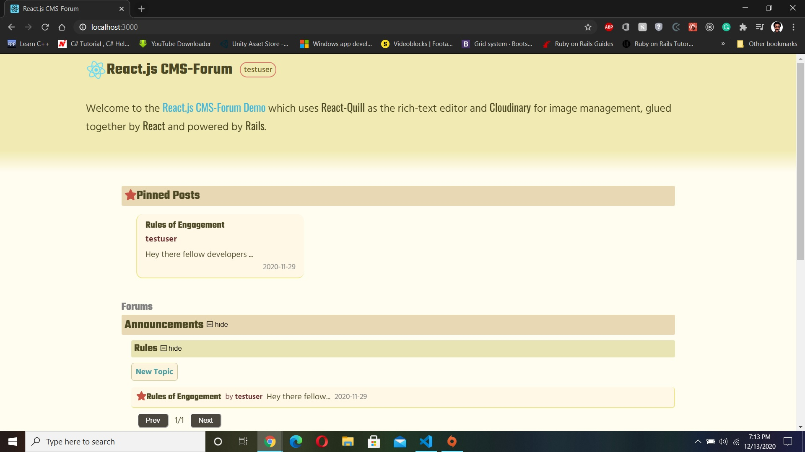

# REACT-Forum CMS
[](https://app.netlify.com/sites/arn-forum-cms/deploys)

Front-end system built with React.js for user manageable Blog. Users will be able to create new posts, edit posts, remove posts, and pin posts through a Content Management System linked to a Ruby on Rails PostgreSQL database Back-end.

## Features
### Blog Post
- Create blog posts
- Edit blog posts
- Remove blog posts
- Pin blog posts
### Authentication System
- Create User Accounts
- Ability to Log into a specified User Account with either a username or email coupled with a password




## [Live DEMO](https://arn-forum-cms.netlify.app/)

## Built With

- HTML, CSS
- JavaScript
- React.js
- React-Router
- PropTypes
- Axios
- NPM Webpack

### Install Dependencies

```
$ npm install
```

### Run Application

```
$ npm run server
```

### Running Tests

```
$ npm run test
```

## Running Linters

### ESLint
- Run `npx eslint .` on the root of your project directory.

### Stylelint
- Run `npx stylelint "**/*.{css,scss}"` on the root of your project directory.


## Author

👤 **Aaron Rory**

- Github: [@Aaron-RN](https://github.com/Aaron-RN)
- Twitter: [@ARNewbold](https://twitter.com/ARNewbold)
- Linkedin: [Aaron Newbold](https://www.linkedin.com/in/aaron-newbold-1b9233187/)
- Website: [AaronRory.com](https://aaronrory.com/)
